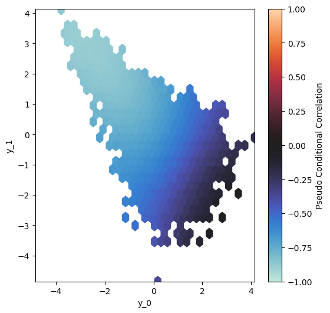

# Graphical Transformation Model

Graphical Transformation Models (GTMs) are a class of probabilistic models designed for multivariate data, capable of:

1. Capturing complex nonlinear interdependencies and arbitrary marginals.

2. Being lasso-regularized towards pairwise conditional independencies, similar to Gaussian graphical models for nonlinear dependencies.

Read the full paper on [arXiv](https://arxiv.org/abs/2503.17845).

## 🎬 Demos 

In this repository, we provide demo scripts to replicate the results from our work. These scripts serve as tutorials and offer a good introduction to applying the model. They can also be used as a starting point for your own data.

#### Simulations

For the simulation studies, we provide the [2D copula demo](demos/demo_2D_copula.ipynb) and the [10D copula demo](demos/demo_10D_rvine.ipynb). These demos illustrate how to train and evaluate the model using a simple 2D copula example, as well as on 10D R-vine data, where we also show how to identify the full conditional independence structure.

#### Application to the MAGIC Dataset

We also provide all the files needed to replicate our analysis on the MAGIC dataset. The [training script](demos/train_gtm_magic.py) is a Python script that runs all models used in the analysis and works on both CPU and CUDA. The choice of marginal degrees, based on a simple heuristic approach, is explained in this [notebook](demos/demo_magic_marginal_transformation_degrees.ipynb). The trained models are already stored, allowing you to directly access the analysis and run the respective notebooks.

The [classification notebook](demos/demo_magic_classification.ipynb) demonstrates how we selected the optimal number of decorrelation layers and how we evaluated model prediction performance. It can also serve as a baseline for creating a classifier based on GTMs. The [Identify Conditional Independence notebook](demos/demo_magic_conditional_independence.ipynb) shows how to analyze conditional dependencies using the GTM and how to utilize the plotting functions to create the graphs featured in the paper. Finally, the [synthetic samples notebook](demos/demo_magic_simulate_synthetic_data.ipynb) illustrates how to sample synthetically from the model and visually compare the learned distribution to the actual training data.

## 📥 Installation

```bash
# Clone the repository
git clone https://github.com/MatthiasHerp/gtm.git
cd your_model_repo

# (Optional) Create a virtual environment
python -m venv gtm_environment
source gtm_environment/bin/activate  # On Windows: gtm_environment\Scripts\activate

# Install dependencies
pip install -r requirements.txt
```

## 🏋️‍♂️ Training

Creat toy example from Joe Copula and define the Model.

```python
from gtm import *
from demos.dataset_helpers import Generic_Dataset

# Toy Data
copula_pv = pv.Bicop(family=pv.BicopFamily.joe, parameters=np.array([[2.5]]), rotation=90)
simulated_data_uniform_train = copula_pv.simulate(n=2000)
simulated_data_train = torch.distributions.Normal(0,1).icdf(torch.tensor(simulated_data_uniform_train)).float()
simulated_data_uniform_validate = copula_pv.simulate(n=2000)
simulated_data_validate = torch.distributions.Normal(0,1).icdf(torch.tensor(simulated_data_uniform_validate)).float()

# Define GTM Model
model = GTM(
    number_variables = 2,
    degree_transformations = 10,
    degree_decorrelation = 40,
    spline_transformation = "bspline",
    spline_decorrelation = "bspline",
    transformation_spline_range = (-10, 10),
    device = "cpu") 

```

Run Hyperparameter Tuning for the spline penalties.

```python
study = model.hyperparameter_tune_penalties( 
        train_dataloader = dataloader_train,
        validate_dataloader = dataloader_validate,
        penalty_decorrelation_ridge_param = None,
        penalty_decorrelation_ridge_first_difference = "sample",
        penalty_decorrelation_ridge_second_difference = "sample",
        penalty_transformation_ridge_second_difference = None,
        optimizer="LBFGS",
        n_trials=30,
        temp_folder=".",
        study_name=None)
        
penalty_splines_params=torch.FloatTensor([
                            0, #study.best_params["penalty_decorrelation_ridge_param"],
                            study.best_params["penalty_decorrelation_ridge_first_difference"],
                            study.best_params["penalty_decorrelation_ridge_second_difference"],
                            0 #study.best_params["penalty_transformation_ridge_second_difference"]
                              ])
```

With the optimal penalties, train the final model with pretraining and then joint training.

```python
# pretrain the marginal transformations
_ = model.pretrain_transformation_layer(dataloader_train)

# train the joint model
_ = model.train(train_dataloader=dataloader_train, validate_dataloader=dataloader_validate, penalty_splines_params=penalty_splines_params)
```

## 📈 Evaluation

Generate synthetic samples and use them to plot the local conditional pseudo-correlations to visualize the dependence structure.

```python
synthetic_samples = model.sample(10000)

model.plot_conditional_dependence_structure(data=synthetic_samples)
```



## Scalability /Runtime Benchmark

We benchmarked the GTM on a 100-dimensional R-Vine model with 10,000 observations in both the training and validation sets, using a single NVIDIA A40 GPU. Two spline basis types—Bernstein polynomials and B-splines—were tested under two optimizers (Adam and LBFGS). The table below reports the average runtime per iteration for both the pretraining and joint training phases.

Note: Due to the de Boor implementation, B-spline training is less sensitive to the spline degree compared to Bernstein polynomials.

| Optimizer | Basis Type | Degree (Transf. / Decorrel.) | Pretraining Time (s) | Joint Training Time (s) |
|-----------|------------|-------------------------------|-----------------------|--------------------------|
| Adam      | Bernstein  | 10 / 10                       | 0.16                  | 1.05                     |
| Adam      | B-spline   | 15 / 20                       | 0.12                  | 2.50                     |
| LBFGS     | Bernstein  | 10 / 10                       | 0.33                  | 2.95                     |
| LBFGS     | B-spline   | 15 / 20                       | 0.33                  | 6.80                     |


## Contact and Contributing

For questions or collaboration inquiries, please contact: Matthias Herp [matthias.herp@bioinf.med.uni-goettingen.de]

## Citation

If you use this code, please cite:

```bibtex
@misc{gtm,
      title={Graphical Transformation Models}, 
      author={Matthias Herp and Johannes Brachem and Michael Altenbuchinger and Thomas Kneib},
      year={2025},
      eprint={2503.17845},
      archivePrefix={arXiv},
      primaryClass={stat.ME},
      url={https://arxiv.org/abs/2503.17845}, 
}
```

## 🛡️ License

This code is released under a custom Non-Commercial Use License. You are free to use, modify, and distribute the code for non-commercial research and educational purposes.

For commercial use, please contact: Matthias Herp [matthias.herp@bioinf.med.uni-goettingen.de]

See the [LICENSE](LICENSE) file for details.

%## ToDos:
%- clean code with automatic software for that